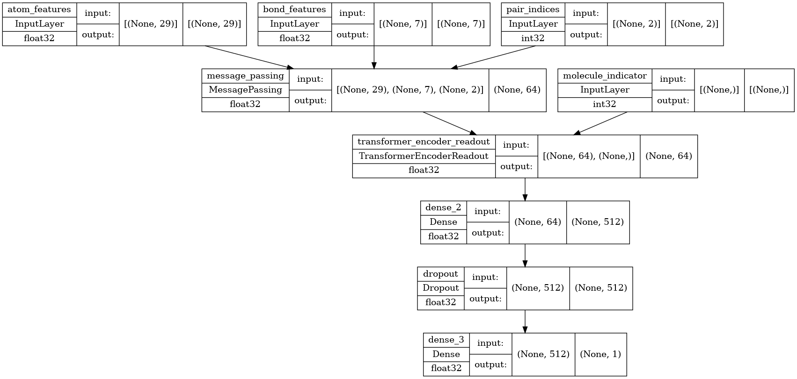

# BBBP Prediction Project
This project aims to predict Blood-Brain Barrier Penetration (BBBP) using machine learning models based on molecular structures and features.

## Overview
The BBBP dataset consists of molecular features extracted from chemical compounds along with their BBBP values. The objective is to build predictive models that determine whether a compound can penetrate the blood-brain barrier.


## Columns:
- Smiles: SMILES representation of chemical compounds
- Name: Name of chemical compounds
- p_np: BBBP classification (1: Penetrates, 0: Doesn't Penetrate)


## Setup

1. Clone the repository.

```bash
git clone https://github.com/RobinMaheshwary/BBBP-PREDICTION
```

2. Install dependencies.

```bash
pip install -r requirements.txt
```

## Model Architecture

<!-- pic embed from ./models/model.png -->



## Future Improvements

- Hyperparameter tuning for models to enhance performance.
- Incorporate additional molecular descriptors for better predictive power.
- Explore deep learning architectures for improved accuracy.


## License
This project is licensed under [DBaJ-NC-CFL](./LICENCE.md). Refer to LICENSE for more details.